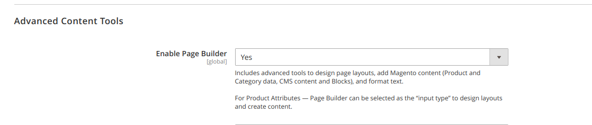

# PageBuilder addon for Vue Storefront & Magento 2 

## Overview
Addition for [divante/magento2-vsbridge-indexer](https://github.com/DivanteLtd/magento2-vsbridge-indexer) module.
It will convert content build with PageBuilder to json structure: cms page, cms block and product/category attribute build with pagebuilder (e.g. description)

Supported items
- Layout
  * rows
  * columns
  * tabs
- Elements
  * text 
  * heading
  * buttons 
  * divider
  * html code
- Media
  * Image
  * Video
  *  Banner
  * Slider
- Add Content
  * Block
  * Products

### Examples:
You can check how html content will be converted to json structure here: [examples](docs/sample/) 

## Requirements
- `divante/magento2-vsbridge-indexer` >= 1.1.0
- Magento Commerce with PageBuilder installed and enabled in configuration
     

## Installation

```json
composer config repositories.divante_pagebuilder vcs https://github.com/DivanteLtd/magento2-vsbridge-pagebuilder
composer require divante/magento2-vsbridge-pagebuilder
```


If you already used `divante/magento2-vsbridge-indexer` you will have to delete all indices previously created by this module.
There will be new mapping for fields in ES.
